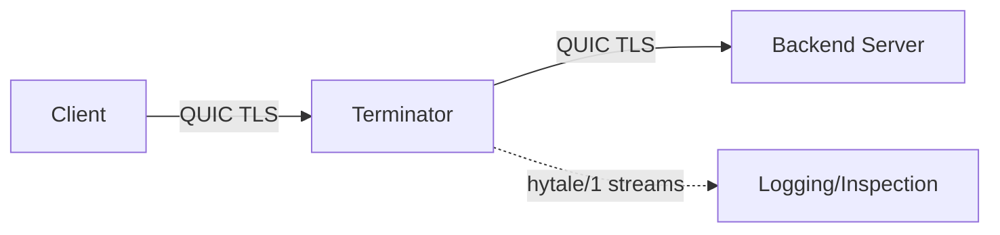

# QUIC Terminator

A Hytale QUIC termination proxy that enables inspection of raw `hytale/1` protocol traffic. Part of the [QUIC Relay](https://github.com/HyBuildNet/quic-relay) project.



## Overview

The terminator acts as a TLS-terminating proxy for QUIC connections. It accepts encrypted QUIC connections from clients, terminates TLS, and establishes a new QUIC connection to the backend server. This allows inspection of the decrypted `hytale/1` protocol streams.

[!] Requires clients to use the [HytaleCustomCert](https://hybuildnet.github.io/HytaleCustomCert/) plugin to disable certificate binding validation.

Features:
- **Target-based certificates** - Different TLS certificates per backend server
- **mTLS support** - Client certificate authentication to backends
- **Stream bridging** - Transparent forwarding of bidirectional and unidirectional QUIC streams
- **Debug logging** - Optional hex dump of protocol traffic

## Usage

This library is designed to be used as a handler within [QUIC Relay](https://github.com/HyBuildNet/quic-relay). See the main project for configuration examples.

### Standalone Usage

```go
import terminator "quic-terminator"

cfg := terminator.Config{
    Listen: "localhost:5521",
    Default: &terminator.TargetConfig{
        CertFile: "server.crt",
        KeyFile:  "server.key",
    },
    Targets: map[string]*terminator.TargetConfig{
        "backend1:5521": {
            CertFile: "backend1.crt",
            KeyFile:  "backend1.key",
        },
    },
}

term, err := terminator.New(cfg)
if err != nil {
    log.Fatal(err)
}
defer term.Close()

// Register backend for incoming connection (by DCID)
dcid := terminator.ParseQUICDCID(initialPacket)
term.RegisterBackend(dcid, "backend1:5521")
```

## Configuration

| Field | Description |
|-------|-------------|
| `Listen` | Internal listener address (`:5521` or `localhost:0` for ephemeral) |
| `Default` | Fallback certificate configuration |
| `Targets` | Map of backend address to certificate configuration |
| `Debug` | Enable packet parsing and logging |
| `DebugPacketLimit` | Max packets to log per stream (0 = unlimited) |

### Target Configuration

| Field | Description |
|-------|-------------|
| `CertFile` | Path to TLS certificate |
| `KeyFile` | Path to TLS private key |
| `BackendMTLS` | Use certificate as client cert for backend mTLS (default: `true`) |

## Packet Handlers

Register handlers to inspect, filter, or modify decrypted Hytale protocol packets:

```go
term.AddPacketHandler(func(dcid string, pkt *protohytale.Packet, fromClient bool) ([]byte, PacketAction) {
    // Return nil, PacketContinue to pass through unchanged
    // Return nil, PacketDrop to drop the packet
    // Return modifiedData, PacketContinue to modify and forward
    return nil, PacketContinue
})
```

Handlers are executed in registration order. If any handler returns `PacketDrop`, the packet is not forwarded.

## How It Works

1. Proxy receives initial QUIC packet from client
2. DCID (Destination Connection ID) is extracted and mapped to backend
3. Packet is forwarded to terminator's internal listener
4. Terminator terminates TLS, selects certificate based on backend
5. New QUIC connection is established to backend
6. Streams are bridged bidirectionally

## License

MIT License. See [LICENSE](LICENSE) for details.

[!] This project is neither related to nor affiliated with HYPIXEL STUDIOS CANADA INC. or any other Trademark owner of Hytale.
